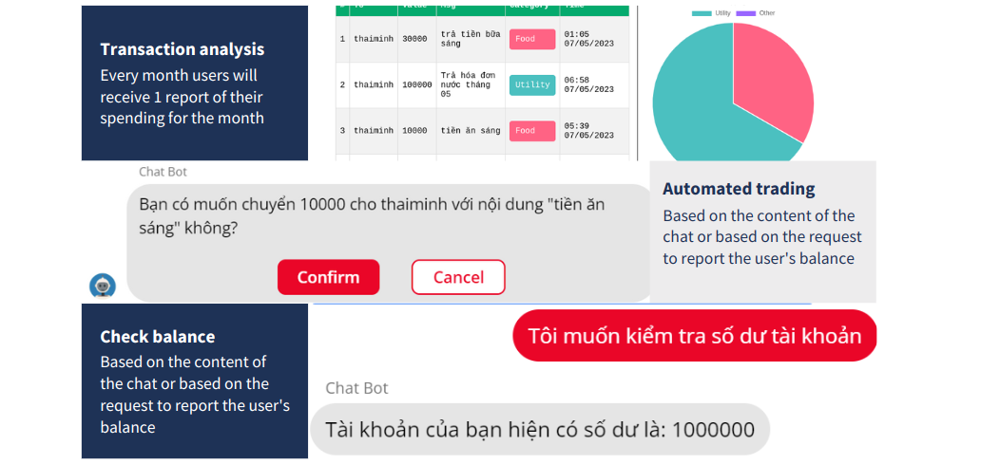

# FinAInce Assistant

**FinAInce Assistant** is a financial chatbot designed to provide various functionalities to help users manage their finances more effectively. With the power of ChatGPT, our chatbot predicts user behavior, automates basic tasks, and offers real-time financial insights.

**Main Features**

- Utilizes ChatGPT to predict user behavior (main highlight)
- Automates basic user tasks (checking account balance, transferring funds, etc.)
- Compiles real-time financial information and visualizes it in various charts
- Offers advice on budgeting and investing




# FinAInce Assistant Web App

This repository contains the frontend code for the FinAInce Assistant web app. This web app is one of the three components of the FinAInce Assistant project. The other component is can be found at:
- [FinAInce Assistant Chatbot](https://github.com/thaiminhpv/ChatBot) - Chatbot that utilizes ChatGPT to predict user behavior and automate tasks.
- [FinAInce Assistant Mock Banking API](https://github.com/thaiminhpv/banking-be) - Mock banking API that provides the banking backend for the web app and chatbot.

## Built With

- ReactJS: Frontend framework for building the chat app
- TailwindCSS: CSS framework for styling the chat app
- Firebase: Database and storage solution for the application

## Getting Started

To get started with the project, follow these steps:

1. Clone the repository to your local machine.
2. Install the required dependencies using `npm install`.
3. Create a Firebase project and add your Firebase credentials to the `src/firebaseConfig.json` file.
4. Make sure that the mock banking API is running and the Chatbot is deployed.
5. Run the development server with `npm start`.

You can using docker to run this project. Just run 
```
docker compose up --build
```

open `http://localhost:3000` to see the result.

## Owner

- [DAN3002](https://github.com/DAN3002)
- [thaiminhpv](https://github.com/thaiminhpv)
- [qwerty22121998](https://github.com/qwerty22121998)
- [khuatdev](https://github.com/khuatdev)
